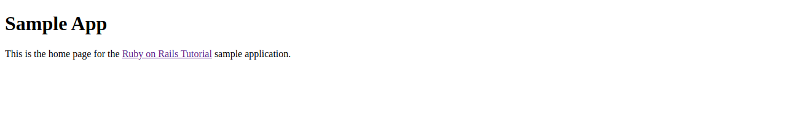
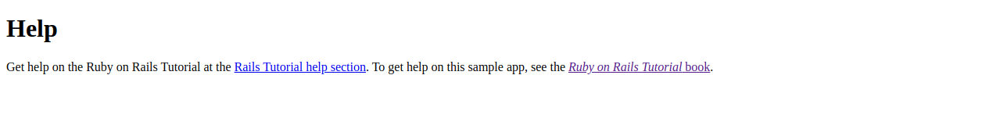
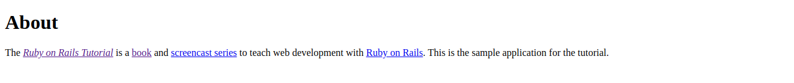
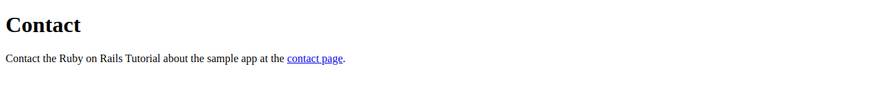

# Ruby on Rails Tutorial sample application
> This project is the Ruby on Rails tutorial start. It's goal is to teach how to create an initialize a Ruby on Rails project
> and how to configure routes for the first time.

This is the sample application for
[*Ruby on Rails Tutorial:
Learn Web Development with Rails*](https://www.railstutorial.org/)
by [Michael Hartl](http://www.michaelhartl.com/).

## License

All source code in the [Ruby on Rails Tutorial](https://www.railstutorial.org/)
is available jointly under the MIT License and the Beerware License. See
[LICENSE.md](LICENSE.md) for details.

## Getting started

> To get a local copy up and running follow these simple example steps.

### Prerequisites

- `Git`
- `Ruby 2.3.6`
- `Rails 6`
- `PostgreSQL`

### Setup

To clone the project in your local environment do the following

- Open a new `terminal` window and navigate to the directory where the project will be stored
- Run the command `git clone git@github.com:oscardelalanza/sample-app.git`
- Run the command `cd sample-app` to enter the project directory

### Install

- Install the required gems running the command `bundle install --without production` 
- Install the required node modules running the command `yarn install`
- Create and migrate the database running the command `rails db:migrate`

### Usage

This is a demonstrative project about Ruby on Rails routes. Visit the following routes in your local server.

- Home page: `http://localhost:3000/static_pages/home`

- Help page: `http://localhost:3000/static_pages/help`

- About page: `http://localhost:3000/static_pages/about`

- Contact page: `http://localhost:3000/static_pages/contact`

### Run tests

- Run the command `rails test`

### Deployment

- To start the local server run the command `rails server`

For more information, see the
[*Ruby on Rails Tutorial* book](https://www.railstutorial.org/book).

## Authors

👤 **Oscar De La Lanza**

- Github: [@oscardelalanza](https://github.com/oscardelalanza)
- Twitter: [@twitterhandle](https://twitter.com/oscardelalanza)
- Linkedin: [Oscar De La Lanza](https://linkedin.com/in/oscardelalanza/)
- Email: oscardelalanza@gmail.com

## 🤝 Contributing

Contributions, issues and feature requests are welcome!

Feel free to check the [issues page](issues/).

## Show your support

Give a ⭐️ if you like this project!
